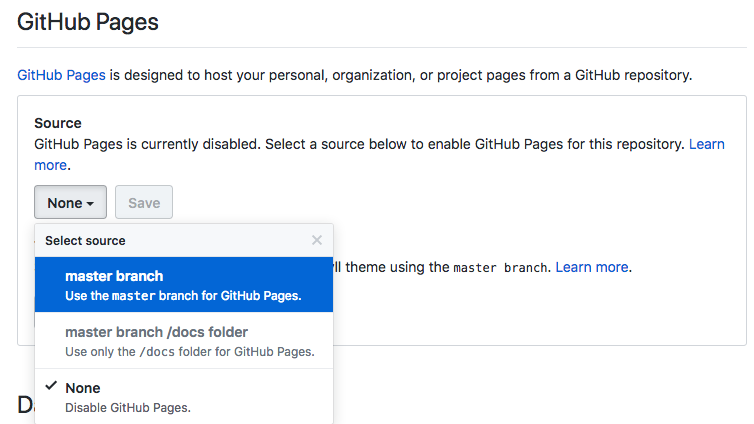
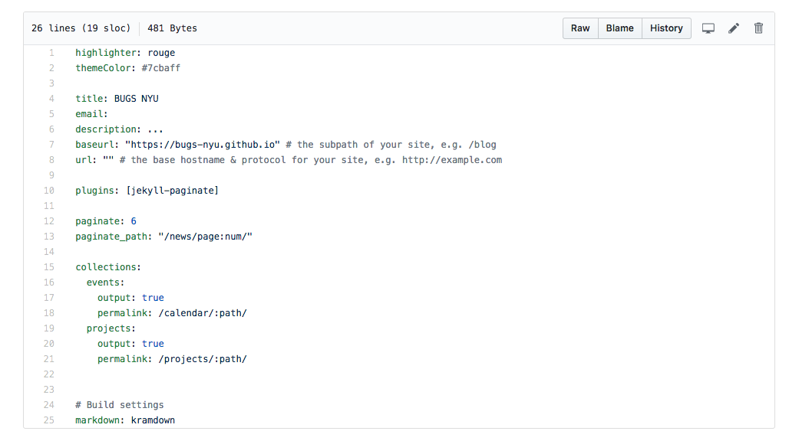
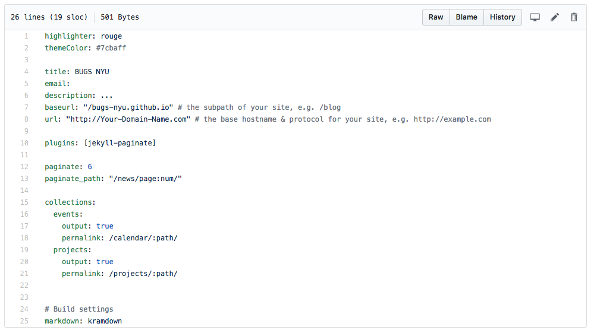

# [bugs-nyu.github.io](https://bugs-nyu.github.io/)

------
[How to Contribute](#how-to-contribute)

[What to Contribute](#what-to-contribute)

[How to use Jekyll](#how-to-use-jekyll)

------

# How to Contribute
## For adding markdown Events
1. Fork this repository
2. Make a new markdown (filename ending with .md) document in the "_events" folder of your fork
3. Follow [the template event](bugs-nyu.github.io/_events/template_event.md) by including this at the top with the correct information:

  ```
  ---
layout: event
title: "Your Event Title"
event_date: 2017-12-31
time: "Event Time"
location: "Event Location"
---```
4. Then include the entire event description using markdown using [this guide](https://guides.github.com/features/mastering-markdown/) for help
5. Make a pull request to the original repository

## For adding markdown News posts
1. Fork this repository
2. Make a new markdown (filename ending with .md) document in the "_posts" folder of your fork
3. Follow [the template event](bugs-nyu.github.io/_posts/template_post.md) by including this at the top with the correct information:

  ```
  ---
layout: post
title: "Your Post Title"
date: 2017-12-31
---```
4. Then include the entire news post description using markdown using [this guide](https://guides.github.com/features/mastering-markdown/) for help
5. Make a pull request to the original repository

## For larger Contributions
1. Fork this repository
2. Make your fork live through your GitHub Pages domain
  * If you don't already have GitHub Pages, set it up by following [this guide](https://guides.github.com/features/pages/)
  * In your forked repository, go into the Settings > to the GitHub Pages section > and change Source from "None" to "master branch" like so: 
  * Go to the file "_config.yml"  and change baseurl and url to your GitHub Pages settings like so: 
3. Make any changes you want
4. When you are ready to make a pull request, you should make a new branch and revert the "_config.yml" file to its original form
5. Make a pull request from your new branch, while keeping your master branch live on your GitHub Pages for reviewers to study before merging your pull request. Please also include a link to the live master branch on your GitHub Pages in your pull request

# What to Contribute
## Ongoing Needs
- Make markdown files for upcoming BUGS events, including:
  - General club meetings
  - Small group project meetings
- Make markdown files for news stories related to open source, including:
  - General news about BUGS
  - Interesting open source projects outside of BUGS
  - Interesting tech news related to open source
  - Etc

## Planned Features
- Display all student contributors
- Add more project details
  - Display To Do's
  - Display student contributors
  - IRC/Discord
- Add IRC Client
  - Link to Discord
  - Info on how to setup your own client

# How to use Jekyll
## Installing Jekyll
### GNU/Linux and MacOS
If you're running GNU/Linux or MacOS on your system check if you have Ruby version 2.2.5 or above and RubyGems installed on your system.

Ruby - https://www.ruby-lang.org/en/downloads/

RubyGems - https://rubygems.org/pages/download

Run `gem install jekyll` once you have RubyGems installed on your system to install Jekyll.

### Windows
If you're running windows take a look at this guide:
https://jekyllrb.com/docs/windows/#installation

## Using Jekyll
To start a development server run `jekyll serve` in the project source folder. The the server will run at `http://localhost:4000`

Resources for Jekyll syntax and usage:
- [Jekyll Docs](https://jekyllrb.com/docs/) for a in-depth guide on Jekyll
- [Liquid Docs](https://shopify.github.io/liquid/) for a guide on the syntax used by Jekyll
- [Liquid Cheatsheet #1](https://www.shopify.com/partners/shopify-cheat-sheet)
- [Liquid Cheatsheet #2](https://devhints.io/jekyll)
- [Liquid Examples](https://gist.github.com/JJediny/a466eed62cee30ad45e2)